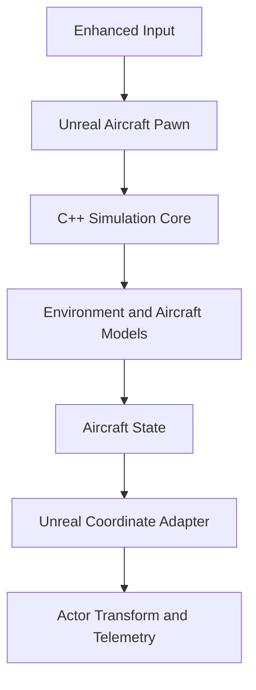

# C152FlightSim

An independent C++ and Unreal Engine flight simulation project developed from scratch by **Berk Sevimli**.

> Phases 1–3 of the baseline simulation are complete. The project currently supports deterministic 6DOF rigid-body propagation, atmospheric and air-data modelling, longitudinal and lateral-directional aerodynamics, propulsion and fuel consumption, landing-gear reactions, braking, runway acceleration, takeoff, and controllable free flight.

## Project Overview

C152FlightSim is a modular flight simulation project based on a Cessna 152 development configuration.

The project separates the numerical simulation from Unreal Engine:

- Unreal Engine provides visualization, user input, scene management, camera control, and runtime telemetry.
- The flight-simulation core owns the aircraft state, environment, force and moment models, and equations of motion.
- An explicit integration layer converts between the core simulation conventions and Unreal Engine coordinates.

The core flight-dynamics code is designed as engine-agnostic C++. It does not depend on Unreal-specific types such as `FVector`, `FRotator`, `UObject`, `AActor`, or `APawn`.

## Engineering Objectives

The project is designed to demonstrate:

- Physics-based flight simulation development
- Modular and reusable C++ architecture
- Deterministic fixed-step execution
- Six-degree-of-freedom rigid-body dynamics
- Aircraft force and moment modelling
- Flight-dynamics coordinate-system management
- Unit and integration testing
- Separation of simulation logic from visualization
- Unreal Engine integration through explicit adapters
- A simulation core that can later support a headless runner

## Architecture



The Pawn produces normalized pilot commands and advances the simulation. It does not solve the aircraft equations of motion.

The simulation core owns:

- Deterministic fixed-step timing
- Control-surface state
- Atmosphere, wind, turbulence, and air data
- Aircraft configuration and mass properties
- Aerodynamic forces and moments
- Propulsion and fuel state
- Landing-gear and braking reactions
- Rigid-body 6DOF state propagation
- Aircraft position, velocity, angular rate, and attitude

## Coordinate Systems

### Body Frame — FRD

The simulation uses a right-handed Forward–Right–Down body frame.

| Axis | Direction |
|---|---|
| +X | Forward |
| +Y | Right |
| +Z | Down |

Body-axis angular rates are:

| Rate | Axis | Positive motion |
|---|---|---|
| `p` | +X | Right roll |
| `q` | +Y | Nose up |
| `r` | +Z | Nose right |

### Navigation Frame — NED

The navigation frame uses North–East–Down coordinates.

| Axis | Direction |
|---|---|
| +X | North |
| +Y | East |
| +Z | Down |

### Unreal World

The Unreal integration layer converts the simulation state to Unreal Engine coordinates.

| Simulation | Unreal |
|---|---|
| North | +X |
| East | +Y |
| Down | -Z |
| Metres | Centimetres |

Attitude is represented by a normalized quaternion describing the active rotation from Body/FRD to Navigation/NED.

## Current Features

### Simulation Foundation

- Engine-agnostic vector and quaternion mathematics
- Aircraft position, velocity, angular-rate, and attitude state
- Aircraft mass and full XZ-coupled inertia representation
- Translational and rotational 6DOF propagation
- Gravity transformation from Navigation/NED to Body/FRD
- Quaternion-based attitude integration and normalization
- Deterministic 120 Hz fixed-step simulation clock
- Frame-hitch protection
- Transactional simulation stepping
- Simulation facade through `FC152Simulation`

### Controls

- Pitch, roll, yaw, throttle, and brake commands
- Control-surface rate limiting
- Control-surface saturation
- Throttle clamping
- Elevator, aileron, and rudder state propagation
- Enhanced Input integration
- Keyboard-controlled runway and flight testing

### Atmosphere and Air Data

- U.S. Standard Atmosphere 1976 troposphere model
- Temperature, pressure, density, and speed-of-sound calculation
- Configurable steady wind in Navigation/NED axes
- Seeded deterministic first-order turbulence
- Air-relative body velocity
- True airspeed
- Angle of attack
- Sideslip angle
- Dynamic pressure
- Mach number
- Environment sampling through `FC152Simulation`

### C152 Development Configuration

- Reference wing area and span
- Equivalent rectangular reference chord
- Aspect-ratio calculation
- Maximum takeoff and ramp mass references
- Piecewise center-of-gravity envelope
- Development mass and inertia baseline
- Engine power and propeller-diameter references
- Development aerodynamic configuration
- Development propulsion and fuel configuration
- Three-point landing-gear configuration

### Aerodynamics

- Linear longitudinal aerodynamic model
- Lift and quadratic drag polar
- Pitching moment model
- Angle-of-attack derivatives
- Elevator control derivatives
- Pitch-rate damping
- Lateral-directional aerodynamic model
- Side-force coefficient
- Rolling and yawing moments
- Sideslip derivatives
- Roll-rate and yaw-rate damping
- Aileron and rudder control derivatives
- Body-axis aerodynamic force and moment output

### Propulsion and Fuel

- Throttle-driven power calculation
- Density-dependent available power
- Fixed-pitch propeller development model
- Propeller advance-ratio handling
- Forward thrust generation
- Deterministic fuel-flow model
- Usable-fuel tracking
- Fuel exhaustion handling
- Fuel consumption coupled to current aircraft mass

### Ground Interaction

- Three-point landing-gear contact model
- Nose and main landing-gear contact locations
- Spring and damping reactions
- Rolling resistance
- Brake-command handling
- Static braking at low ground speed
- Brake-force capacity limiting
- Ground-contact status and active-contact count
- Runway start from zero forward speed
- Throttle acceleration and takeoff transition

### Unreal Integration

- C++ aircraft Pawn
- Simulation-state to Unreal-transform adapter
- NED position to Unreal world conversion
- Body/FRD attitude conversion
- Runtime simulation configuration
- Runtime aircraft-state propagation
- Atmosphere, wind, air-data, fuel, load, and ground-contact telemetry
- Runway acceleration, takeoff, and controllable free-flight scenario

## Current Simulation Status

Phases 1–3 of the baseline simulator are complete.

The aircraft can currently:

1. Start stationary on the runway.
2. Remain held by the wheel brakes.
3. Increase engine power using the throttle.
4. Accelerate after brake release.
5. Generate aerodynamic lift as airspeed increases.
6. Transition from ground contact to airborne flight.
7. Respond to elevator, aileron, and rudder commands.
8. Consume fuel and reduce the current simulated mass.
9. React to steady wind and deterministic turbulence.
10. Propagate its complete 6DOF state at a deterministic 120 Hz rate.

The complete runtime load path is:

```text
Pilot command
→ Control-surface state
→ Atmosphere and relative airflow
→ Aerodynamic, propulsion, and ground loads
→ Total body forces and moments
→ Rigid-body 6DOF propagation
→ Aircraft state
→ Unreal transform
```

## Model Limitations

The current implementation is a development baseline rather than a validated high-fidelity Cessna 152 flight model.

Important limitations include:

- Aerodynamic stability and control derivatives are initial engineering estimates.
- The current aerodynamic model is linear and is not valid throughout the stall or post-stall flight envelope.
- Aerodynamic coefficients have not yet been calibrated against complete flight-test or manufacturer performance data.
- The propulsion model is a simplified fixed-pitch development model.
- Propeller slipstream, torque, P-factor, and gyroscopic effects are not yet modelled in detail.
- Fuel consumption changes total mass, but fuel-distribution effects on center of gravity and inertia are not yet included.
- The landing-gear model represents normal runway contact and braking, not crash or inverted-impact dynamics.
- Tire lateral-force dynamics and detailed steering are not yet implemented.
- Ground effect is not yet included.
- The turbulence model is a seeded first-order Gauss–Markov process, not a certification-grade Dryden or von Kármán implementation.
- Control feel and handling qualities have not yet been calibrated.

These limitations are intentionally documented so that development estimates are not presented as validated aircraft data.

## Automated Tests

The project currently contains **77 passing Unreal Automation tests**.

Test coverage includes:

| Test group | Coverage |
|---|---|
| Control surfaces | Neutral return, rate limiting, saturation, and throttle clamping |
| Fixed-step clock | Step count and frame-hitch protection |
| Mathematics | Vector algebra, normalization, quaternion rotation, and composition |
| Aircraft state | Default initialization and quaternion normalization |
| Mass properties | Validation, inertia application, and inverse-inertia round trip |
| Rigid-body 6DOF | Constant force, moment, yaw rate, gravity, and state propagation |
| Standard atmosphere | Sea-level and troposphere reference values and invalid altitude handling |
| Wind and turbulence | Steady wind, deterministic turbulence, and validation |
| Air data | Relative airflow, axis conventions, angle of attack, sideslip, and invalid inputs |
| Aircraft configuration | Geometry, mass limits, CG envelope, propulsion references, and validation |
| Mass balance | Weighted CG calculation, envelope integration, and invalid inputs |
| Aerodynamics | Configuration, longitudinal loads, damping, and lateral-directional loads |
| Propulsion | Configuration, thrust, power, advance ratio, and invalid inputs |
| Fuel | Capacity, consumption, exhaustion, and invalid inputs |
| Powerplant | Propulsion/fuel coupling and power availability |
| Ground reaction | Contact geometry, suspension, rolling resistance, braking, and static hold |
| Simulation integration | Environment, aircraft loads, ground contact, fuel-mass coupling, roll response, and yaw response |
| Unreal adapters | Coordinate, attitude, transform, and pose round-trip conversion |

Run all tests from the Unreal console:

```text
Automation RunTests C152FlightSim
```

## Repository Structure

```text
C152FlightSim/
├── Config/
├── Content/
│   └── C152FlightSim/
│       ├── Aircraft/
│       ├── Input/
│       └── Maps/
├── Source/
│   └── C152FlightSim/
│       ├── Public/
│       │   ├── FlightDynamics/
│       │   └── Integration/
│       └── Private/
│           ├── FlightDynamics/
│           ├── Integration/
│           └── Tests/
├── C152FlightSim.uproject
└── README.md
```

## Build Requirements

- Unreal Engine 5.8.2
- Visual Studio 2022
- Windows x64
- Git
- Git LFS

## Building the Project

Clone the repository and download the LFS-managed assets:

```bash
git lfs install
git clone https://github.com/berksvml/c152-flight-simulator.git
cd c152-flight-simulator
git lfs pull
```

The project's `EngineAssociation` identifies the development engine installation. If Unreal cannot locate that installation on another machine, use **Switch Unreal Engine version** to select a local Unreal Engine 5.8.2 installation.

Unreal may update the local `.uproject` association during this step.

Generate the Visual Studio project files if required.

Build using:

```text
Configuration: Development Editor
Platform: x64
```

Open `C152FlightSim.uproject` after the build completes.

## Development Roadmap

### Phase 1 — Simulation Foundation — Complete

- [x] Enhanced Input
- [x] Control-surface command model
- [x] Deterministic fixed-step clock
- [x] Aircraft-state types
- [x] Vector and quaternion mathematics
- [x] Unreal coordinate adapter
- [x] Simulation facade
- [x] Mass and inertia representation
- [x] 6DOF rigid-body propagation
- [x] Gravity and analytical load verification
- [x] Unreal Pawn runtime integration

### Phase 2 — Atmosphere and Air Data — Complete

- [x] Standard atmosphere
- [x] Wind and deterministic turbulence
- [x] Air-data calculations
- [x] Simulation environment integration
- [x] Unreal runtime environment telemetry

### Phase 3 — Baseline Aircraft Flight Model — Complete

- [x] C152 reference geometry and configuration
- [x] Development mass and inertia baseline
- [x] Mass-balance and center-of-gravity envelope model
- [x] Longitudinal aerodynamic forces and moments
- [x] Lateral-directional aerodynamic forces and moments
- [x] Propulsion model
- [x] Fuel model and mass coupling
- [x] Three-point landing-gear reactions
- [x] Rolling resistance and static braking
- [x] Integrated runway acceleration and takeoff
- [x] Elevator, aileron, and rudder flight response
- [x] Unreal runtime aircraft-model integration

### Phase 4 — Calibration and Flight-Envelope Development

- [ ] Steady-state trim solver
- [ ] Aerodynamic-coefficient calibration
- [ ] Propulsion-model calibration
- [ ] Nonlinear lift and stall behaviour
- [ ] Takeoff and climb-performance verification
- [ ] Cruise and glide-performance verification
- [ ] Static and dynamic stability assessment
- [ ] Control-response and handling-quality assessment
- [ ] Expanded ground and landing validation
- [ ] Regression cases for validated operating points

### Future Visualization and Aircraft Systems

- [ ] Detailed C152 visual model
- [ ] Control-surface animation
- [ ] Cockpit instruments
- [ ] Expanded engine systems
- [ ] Electrical system
- [ ] Detailed fuel-distribution system
- [ ] Additional runtime telemetry and logging

## Verification Strategy

Each model is developed and tested independently before being integrated into the complete simulation.

The verification approach includes:

- Deterministic fixed-step tests
- Mathematical identity tests
- Coordinate-convention tests
- State round-trip tests
- Configuration validation tests
- Force and moment test cases
- Known analytical rigid-body scenarios
- Model-to-simulation integration tests
- Control-command response tests
- Runtime Unreal integration checks
- Future trim and performance reference cases

## Reference Basis

The project currently uses a mixture of published reference information and explicitly identified development estimates.

Reference categories include:

- Cessna 152 geometry and operating limitations
- FAA type-certificate reference data
- Published Cessna 152 information-manual data
- A simplified research-model mass and inertia baseline
- Engineering estimates for aerodynamic stability and control derivatives
- Development estimates for propulsion and landing-gear behaviour

Published data, research-derived values, and engineering assumptions are identified separately in the source-code comments.

## Disclaimer

This project is an engineering development and portfolio project.

It is not certified or intended for:

- Operational flight training
- Aircraft design approval
- Real-world navigation
- Safety-critical use
- Prediction of certified aircraft performance

## Author

**Berk Sevimli**

Aerospace Engineer  
C++ Simulation and Flight Dynamics
